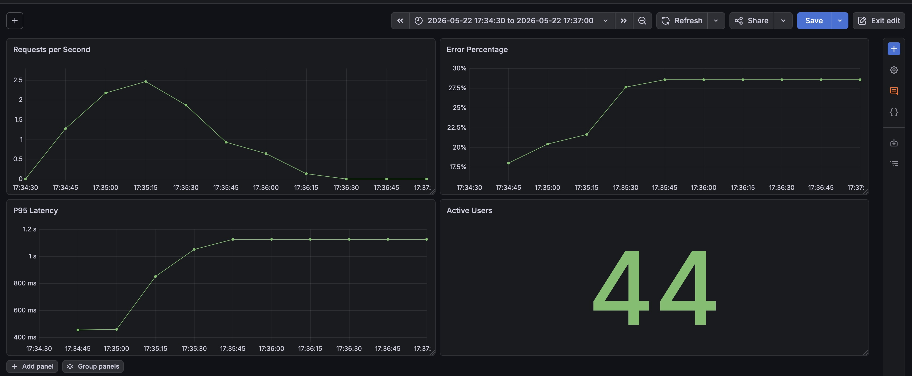

# Prometheus Demo App

A lightweight Python Flask application instrumented with Prometheus metrics for practicing PromQL, histograms, latency monitoring, error rates, Grafana dashboards, and observability concepts.


---

## Dashboard Preview



---

## Architecture

```text
Client Traffic
      ↓
Flask Demo App
      ↓
/metrics
      ↓
Prometheus
      ↓
Grafana Dashboards
```

---

## Features

- Prometheus `/metrics` endpoint
- HTTP request counters
- Active users gauge
- Request latency histogram
- Randomized HTTP status codes for realistic monitoring practice
- Dockerized deployment
- Designed to integrate with a separate Prometheus monitoring stack

---

## Tech Stack

- Python
- Flask
- prometheus_client
- Docker
- Docker Compose
- Prometheus

---

## Application Endpoints

| Endpoint | Description |
|---|---|
| `/` | Demo endpoint with random `200` and `500` responses |
| `/api` | Demo API endpoint with random `200`, `404`, and `500` responses |
| `/metrics` | Prometheus metrics endpoint |

---

## Exposed Metrics

### Counter: `demo_http_requests_total`

Tracks total HTTP requests grouped by `method`, `endpoint`, and `status`.

Example:

```text
demo_http_requests_total{endpoint="/api", method="GET", status="500"}
```

### Gauge: `demo_active_users`

Simulates current active users count.

### Histogram: `demo_http_request_duration_seconds`

Tracks request latency by endpoint.

Configured buckets:

```text
0.05, 0.1, 0.2, 0.3, 0.5, 1, 2, 5
```

---

## Project Structure

```text
prometheus-demo-app/
├── app.py
├── requirements.txt
├── Dockerfile
├── docker-compose.yml
├── README.md
├── .gitignore
└── screenshots/
```

---

## Docker Compose

This application connects to the external Docker network created by the monitoring stack.

```yaml
services:
  demo-app:
    build: .
    container_name: prometheus-demo-app
    ports:
      - "8000:8000"
    networks:
      - monitoring

networks:
  monitoring:
    external: true
    name: monitoring-lab_default
```

Start the application:

```bash
docker compose up -d --build
```

Verify metrics:

```bash
curl http://localhost:8000/metrics
```

---

## Prometheus Integration

Prometheus configuration is managed in the monitoring stack repository:

```text
https://github.com/DVanyan/monitoring-lab
```

Add this scrape job to `prometheus.yml`:

```yaml
- job_name: "demo-app"
  static_configs:
    - targets: ["prometheus-demo-app:8000"]
```

Reload or restart Prometheus after updating the configuration.

---

## Generate Test Traffic

### Basic traffic

```bash
timeout 300 bash -c 'while true; do curl -s localhost:8000 > /dev/null; sleep 0.1; done'
```

### API traffic

```bash
timeout 300 bash -c 'while true; do curl -s localhost:8000/api > /dev/null; sleep 0.1; done'
```

---

## Example Metrics

```text
demo_http_requests_total{endpoint="/api",status="500"} 125
demo_active_users 47
demo_http_request_duration_seconds_bucket{le="0.5"} 312
```

---

## PromQL Examples

### Requests per second

```promql
rate(demo_http_requests_total[1m])
```

### Requests per second grouped by status

```promql
sum by(status) (
  rate(demo_http_requests_total[1m])
)
```

### API requests per second grouped by status

```promql
sum by(status) (
  rate(demo_http_requests_total{endpoint="/api"}[1m])
)
```

### API error percentage

```promql
sum(rate(demo_http_requests_total{endpoint="/api", status=~"404|500"}[5m]))
/
sum(rate(demo_http_requests_total{endpoint="/api"}[5m]))
* 100
```

### p95 request latency

```promql
histogram_quantile(
  0.95,
  sum by(le, endpoint) (
    rate(demo_http_request_duration_seconds_bucket[5m])
  )
)
```

---

## Learning Goals

This project is designed for practicing:

- Prometheus fundamentals
- PromQL
- Counters, Gauges, and Histograms
- Labels and aggregation
- Error rate monitoring
- Request latency analysis
- Histogram quantiles
- Grafana dashboards
- Observability concepts
- Alerting fundamentals

---

## Skills Demonstrated

- Prometheus instrumentation
- PromQL
- Histogram metrics
- Error rate monitoring
- Request latency monitoring
- Docker networking
- Flask application monitoring
- Metrics aggregation
- Grafana visualization
- Observability fundamentals

---

## Related Repository

Monitoring stack repository:

```text
https://github.com/DVanyan/monitoring-lab
```

Includes:

- Prometheus
- Grafana
- Node Exporter
- cAdvisor
- Blackbox Exporter
- Alertmanager| `/metrics` | Prometheus metrics endpoint |

---

## Exposed Metrics

### Counter: `demo_http_requests_total`

Tracks total HTTP requests grouped by:

- method
- endpoint
- status

Example:

```text
demo_http_requests_total{endpoint="/api", method="GET", status="500"}
```

---

### Gauge: `demo_active_users`

Simulates current active users count.

---

### Histogram: `demo_http_request_duration_seconds`

Tracks request latency by endpoint.

Configured buckets:

```text
0.05, 0.1, 0.2, 0.3, 0.5, 1, 2, 5
```

---

## Project Structure

```text
prometheus-demo-app/
├── app.py
├── requirements.txt
├── Dockerfile
├── docker-compose.yml
├── README.md
├── .gitignore
└── screenshots/
```

---

## Docker Compose

This application connects to the external Docker network created by the monitoring stack.

```yaml
services:
  demo-app:
    build: .
    container_name: prometheus-demo-app
    ports:
      - "8000:8000"
    networks:
      - monitoring

networks:
  monitoring:
    external: true
    name: monitoring-lab_default
```

Start the application:

```bash
docker compose up -d --build
```

Verify metrics:

```bash
curl http://localhost:8000/metrics
```

---

## Prometheus Integration

Prometheus configuration is managed in the monitoring stack repository:

```text
https://github.com/DVanyan/monitoring-lab
```

Add this scrape job to `prometheus.yml`:

```yaml
- job_name: "demo-app"
  static_configs:
    - targets: ["prometheus-demo-app:8000"]
```

Reload or restart Prometheus after updating the configuration.

---

## Generate Test Traffic

### Basic traffic

```bash
timeout 300 bash -c 'while true; do curl -s localhost:8000 > /dev/null; sleep 0.1; done'
```

---

### API traffic

```bash
timeout 300 bash -c 'while true; do curl -s localhost:8000/api > /dev/null; sleep 0.1; done'
```

---

## Example Metrics

```text
demo_http_requests_total{endpoint="/api",status="500"} 125
demo_active_users 47
demo_http_request_duration_seconds_bucket{le="0.5"} 312

---

## PromQL Examples

### Requests per second

```promql
rate(demo_http_requests_total[1m])
```

---

### Requests per second grouped by status

```promql
sum by(status) (
  rate(demo_http_requests_total[1m])
)
```

---

### API requests per second grouped by status

```promql
sum by(status) (
  rate(demo_http_requests_total{endpoint="/api"}[1m])
)
```

---

### API error percentage

```promql
sum(rate(demo_http_requests_total{endpoint="/api", status=~"404|500"}[5m]))
/
sum(rate(demo_http_requests_total{endpoint="/api"}[5m]))
* 100
```

---

### p95 request latency

```promql
histogram_quantile(
  0.95,
  sum by(le, endpoint) (
    rate(demo_http_request_duration_seconds_bucket[5m])
  )
)
```

---

## Learning Goals

This project is designed for practicing:

- Prometheus fundamentals
- PromQL
- Counters, Gauges, and Histograms
- Labels and aggregation
- Error rate monitoring
- Request latency analysis
- Histogram quantiles
- Grafana dashboards
- Observability concepts
- Alerting fundamentals

---

## Related Repository

Monitoring stack repository:

```text
https://github.com/DVanyan/monitoring-lab
```

Includes:

- Prometheus
- Grafana
- Node Exporter
- cAdvisor
- Blackbox Exporter
- Alertmanager

## Skills Demonstrated

- Prometheus instrumentation
- PromQL
- Histogram metrics
- Error rate monitoring
- Request latency monitoring
- Docker networking
- Flask application monitoring
- Metrics aggregation
- Grafana visualization
- Observability fundamentals
